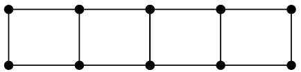

## QUESTÕES - Grupo I: CONTROLE DE FLUXO

> 1.  Um rapaz está sentado à mesa de um bar aguardando a namorada, que está atrasada.Enquanto espera pacientemente, brinca de fazer quadrados com palitos de fósforo comomostra a figura abaixo:

>Quantos palitos são necessários para fazer 200  quadrados?

Se:
$$\text{1 quadrado} = \text{4 Arestas}$$

$$\text{2 quadrados} = \text{7 Arestas}$$

$$\text{3 quadrados} = \text{10 Arestas}$$

$$\text{4 quadrados} = \text{13 Arestas}$$

Então

$$ n_a = n_q \times 3  +  1$$ 

Logo:
$$ n_a = 200 \times 3  +  1$$ 
Dessa forma será necessario 203 palitos para chegar ao objetivo.

---

>2. Existem cinco casas, cada uma pintada de uma cor diferente: cinza, bege, rosa, lilás e verde. As casas são habitadas por moradores com nacionalidades diferentes: brasileiro, português, italiano, japonês e francês. Os moradores possuem animais de estimação que também são diferentes: cachorro, peixes, pato, gato e canário. Cada morador tem uma bebida preferida: chocolate quente, chá, coca-cola, leite e café. Eles possuem, ainda, diferentes tipos de carro: Uno, Celta, Ka, Corsa e Palio. Os dados disponíveis são os seguintes
>

>* O Celta pertence ao dono da casa ao lado da casa do dono dos peixes.
>* O francês mora na casa rosa.
>* Na casa verde se bebe chocolate quente.
>* O português bebe chá.
>* A casa verde fica imediatamente à direita da casa cinza.
>* O dono do Celta mora na casa lilás.
>* O italiano mora ao lado da casa bege.
>* Na casa do centro se bebe leite.
>* O dono do Ka mora na casa ao lado da do dono do canário.
>* O brasileiro tem um cachorro.
>* O dono do Corsa bebe café.
>* O japonês tem um Palio.
>* O italiano mora na primeira casa, e do seu lado esquerdo não existe nenhuma casa.
>* O dono do Uno tem um gato.

 Para cada casa, descubra qual é a nacionalidade do habitante, qual animal este possui, qual a sua bebida preferida e qual o seu automóvel. Depois responda:

Tabela de analise:
| Atributo      | Casa 1  | Casa 2 | Casa 3 | Casa 4 | Casa 5 |
| :------------ | :------: | :------: | :-----: | :-------: | :-------: |
| Cor           |Rosa|bege|Lilas|Cinza|Verde|
| Nacionalidade |Italiano|        |Brasileiro|Português|Japonês|
| Animal        |Gato|Peixes|Cachorro|        |Canario|
| Bebida        |Coca-Cola|Café|Leite   |Chá|Chocolate Quente|
| Carro         |Uno|Corça|Celta|Ka|Palio|

>a. Quem tem um pato?
O

O Português

>b. Quem bebe Coca-Cola?

O Italiano

---

> 3. Dadas as premissas a seguir, verifique qual sentença representa a conclusão correta:
Os soldados de um batalhão têm de obedecer às decisões de um comandante para atingir os seus objetivos.
Uma equipe de futebol é como um batalhão.
Logo:
a. Os jogadores de uma equipe de futebol têm de obedecer às decisões de um comandante (treinador) para atingir os seus objetivos.
b. Os jogadores de futebol utilizam armas.
c. Os soldados jogam futebol.

a resposta é o item "a":

"Os jogadores de uma equipe de futebol têm de obedecer às decisões de um comandante (treinador) para atingir os seus objetivos."

---

> 4. Considerando ( x < 4 ) e ( y < 5 ), avalie as expressões abaixo e classifique o resultado como verdadeiro ou falso:

> $$\text{a. }{( x = 4 ) e ( y = 7 )}$$

Falso, ambos estão fora dos intervalos.
>$$\text{b. }{( x < 3 ) ou ( y \neq 7 )}$$

Verdade, x está de acordo com enucnciado, menor que 4, e y não sendo 7 não tem implicação negativa.
>$$\text{c. }{( x \geq 2 ) e ( y = 5 )}$$

Falso, dizendo que y é iguala a 5, ja contradiz com y menor que 5 no enunciado
>$$\text{d. }{\text{não } (( x \neq 2 ) e ( y > 4 ))}$$

Verdade, como a expressão sugere que y é maior que 4, dessa forma, pode ser quamquer valor maior que 5, cujo pé o limite do enunciado, dessa forma a espressão interna é falsa, como temos uma negação, logo será verdadeiro
>$$\text{e. }{( x < 5 ) e ( y > 2 ) ou ( x \neq 7 )}$$

Verdade, como temos um "ou", e uma das espressõs comparadas via "ou" é sempre verdade, no caso a de que x é diferente de 7, contempla os intervalos

Avalie as expressões, indicando o resultado final: **verdadeiro** ou **falso**.

$${a. ( A > 3 ) e ( C = 8 * 4 )}$$

$${b. ( A \neq 2 ) \text{ ou } ( B \leq -2 * (100 \% 5) ) }$$

$${c. ( A = 15 ) ou ( (B \geq 2 ) e ( E \neq "rosa") )}$$
$${d. ( D + E = \text{"azul amarelo"} )}$$

$${e. ( B > A ) e ( C \neq A )}$$

$${f. ( E \neq D ) ou ( (A > B ) e ( B < (A \% 3)) )}$$