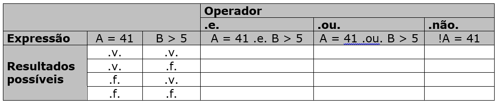

## QUESTÕES - Grupo I: CONTROLE DE FLUXO

> 1.  Um rapaz está sentado à mesa de um bar aguardando a namorada, que está atrasada.Enquanto espera pacientemente, brinca de fazer quadrados com palitos de fósforo comomostra a figura abaixo:


>Quantos palitos são necessários para fazer 200  quadrados?

Se:
$$\text{1 quadrado} = \text{4 Arestas}$$

$$\text{2 quadrados} = \text{7 Arestas}$$

$$\text{3 quadrados} = \text{10 Arestas}$$

$$\text{4 quadrados} = \text{13 Arestas}$$

Então

$$ n_a = n_q \times 3  +  1$$ 

Logo:
$$ n_a = 200 \times 3  +  1$$ 
Dessa forma será necessario 203 palitos para chegar ao objetivo.

---

>2. Existem cinco casas, cada uma pintada de uma cor diferente: cinza, bege, rosa, lilás e verde. As casas são habitadas por moradores com nacionalidades diferentes: brasileiro, português, italiano, japonês e francês. Os moradores possuem animais de estimação que também são diferentes: cachorro, peixes, pato, gato e canário. Cada morador tem uma bebida preferida: chocolate quente, chá, coca-cola, leite e café. Eles possuem, ainda, diferentes tipos de carro: Uno, Celta, Ka, Corsa e Palio. Os dados disponíveis são os seguintes
>


>* O Celta pertence ao dono da casa ao lado da casa do dono dos peixes.
>* O francês mora na casa rosa.
>* Na casa verde se bebe chocolate quente.
>* O português bebe chá.
>* A casa verde fica imediatamente à direita da casa cinza.
>* O dono do Celta mora na casa lilás.
>* O italiano mora ao lado da casa bege.
>* Na casa do centro se bebe leite.
>* O dono do Ka mora na casa ao lado da do dono do canário.
>* O brasileiro tem um cachorro.
>* O dono do Corsa bebe café.
>* O japonês tem um Palio.
>* O italiano mora na primeira casa, e do seu lado esquerdo não existe nenhuma casa.
>* O dono do Uno tem um gato.

 Para cada casa, descubra qual é a nacionalidade do habitante, qual animal este possui, qual a sua bebida preferida e qual o seu automóvel. Depois responda:


Tabela de analise:
| Atributo      | Casa 1  | Casa 2 | Casa 3 | Casa 4 | Casa 5 |
| :------------ | :------: | :------: | :-----: | :-------: | :-------: |
| Cor           |Rosa|bege|Lilas|Cinza|Verde|
| Nacionalidade |Italiano|        |Brasileiro|Português|Japonês|
| Animal        |Gato|Peixes|Cachorro|        |Canario|
| Bebida        |Coca-Cola|Café|Leite   |Chá|Chocolate Quente|
| Carro         |Uno|Corça|Celta|Ka|Palio|


>a. Quem tem um pato?
O

O Português

>b. Quem bebe Coca-Cola?

O Italiano

---

> 3. Dadas as premissas a seguir, verifique qual sentença representa a conclusão correta:
Os soldados de um batalhão têm de obedecer às decisões de um comandante para atingir os seus objetivos.
Uma equipe de futebol é como um batalhão.
Logo:
a. Os jogadores de uma equipe de futebol têm de obedecer às decisões de um comandante (treinador) para atingir os seus objetivos.
b. Os jogadores de futebol utilizam armas.
c. Os soldados jogam futebol.

a resposta é o item "a":

"Os jogadores de uma equipe de futebol têm de obedecer às decisões de um comandante (treinador) para atingir os seus objetivos."

---

> 4. Considerando ( x < 4 ) e ( y < 5 ), avalie as expressões abaixo e classifique o resultado como verdadeiro ou falso:

> $$\text{a. }{( x = 4 ) e ( y = 7 )}$$

Falso, ambos estão fora dos intervalos.
>$$\text{b. }{( x < 3 ) ou ( y \neq 7 )}$$

Verdade, x está de acordo com enucnciado, menor que 4, e y não sendo 7 não tem implicação negativa.
>$$\text{c. }{( x \geq 2 ) e ( y = 5 )}$$

Falso, dizendo que y é iguala a 5, ja contradiz com y menor que 5 no enunciado
>$$\text{d. }{\text{não } (( x \neq 2 ) e ( y > 4 ))}$$

Verdade, como a expressão sugere que y é maior que 4, dessa forma, pode ser quamquer valor maior que 5, cujo pé o limite do enunciado, dessa forma a espressão interna é falsa, como temos uma negação, logo será verdadeiro
>$$\text{e. }{( x < 5 ) e ( y > 2 ) ou ( x \neq 7 )}$$

Verdade, como temos um "ou", e uma das espressõs comparadas via "ou" é sempre verdade, no caso a de que x é diferente de 7, contempla os intervalos

---

>Para resolver este exercício, considere a seguinte atribuição de valores às variáveis:

>A ← 15
B ← −1
C ← 32
D ← “azul”
E ← “amarelo”

>Avalie as expressões, indicando o resultado final: **verdadeiro** ou **falso**.

>$${a. ( A > 3 ) e ( C = 8 * 4 )}$$

Verdade, pois ( A > 3 ) e ( C = 8 * 4 ) são exatamnete equivalnete as definições do enunciado

>$${b. ( A \neq 2 ) \text{ ou } ( B \leq -2 * (100 \% 5) ) }$$

Verdade, sendo uma inclusão, sabendo que ${( A \neq 2 )}$ é verdade, logo a expressão é verdade.

>$${c. ( A = 15 ) ou ( (B \geq 2 ) e ( E \neq "rosa") )}$$

Verdade, mesma coisa da anterior, sendo inclusão, e sendo ( A = 15 ) verdade, logo é verdade


>$${d. ( D + E = \text{"azul amarelo"} )}$$

Verdade, vamos dizer que o correto mesmo seria "azulamarelo", sem espaço

>$${e. ( B > A ) e ( C \neq A )}$$

Falso, de cara sendo conjunção, como ( B > A ) é falso, então a expressão é falsa

>$${f. ( E \neq D ) ou ( (A > B ) e ( B < (A \% 3)) )}$$


Verdade, mesma coisa da b e c, sendo inclusão, e sendo ${( E \neq D )}$ verdade, logo é verdade

---

> 6. Complete a tabela-verdade a seguir:



Tabela de analise:
|A = 41  |B > 5  | A .e. B | A .ou. B | !A |
|:-:|:-:|:-:|:-:|:-:|
|V|V|V|V|F|
|V|F|F|V|F|
|F|V|V|V|V|
|F|F|F|F|V|


---

## QUESTÕES - Grupo II: PROGRAMAS SEQUENCIAIS SIMPLES

> 1. Fazer um programa que pergunta um valor em metros e imprime o correspondente em decímetros, centímetros e milímetros.
```C
#include <stdio.h>

int main (void){
    double metros;

    printf("Defina valor em metros\n");

    scanf("%lf", &metros);

    printf("\n - - - - - - - - Conversão - - - - - - - - \n");

    printf("\nmetros : %lf", metros);
    printf("\nDecimetros : %lf", (metros*10));
    printf("\nCentimetros : %lf", (metros*100));
    printf("\nmilimetros : %lf", metros*1000);
    return 0;
}
```

---

> 2. Fazer um programa que imprime uma tabela com a tabuada de 1 a 9.

```C
#include <stdio.h>

int main (void){
    for (int i = 1 ; i < 11; i++){
        for (int j = 1 ; j < 11; j++){
            printf(" | | ");
            printf("%d", i);
            printf(" + ");
            printf("%d", j);
            printf(" = %d ", i+j);
            printf(" | | ");
            printf("%d", i);
            printf(" - ");
            printf("%d", j);
            printf(" = %d ", i-j);
            printf(" | | ");
            printf("%d", i);
            printf(" x ");
            printf("%d", j);
            printf(" = %d ", i*j);
            printf(" | | ");
            printf("%d", i);
            printf(" / ");
            printf("%d", j);
            printf(" = %lf \n", float(i)/float(j));
        }    
    }

    return 0;
}
```
---

> 3. Fazer um programa que solicita um número decimal e imprime o correspondente em hexadecimal e octal.
```C
#include <stdio.h>

int main(void) {
    int numero;

    printf("Digite um número decimal: ");
    scanf("%d", &numero);

    printf("\n--- Conversões ---\n");
    printf("Decimal: %d\n", numero);
    printf("Octal: %o\n", numero);
    printf("Hexadecimal: %X\n", numero);

    return 0;
}
```
---

> 4. Fazer um programa que pergunte um valor em graus Fahrenheit e imprime no vídeo o correspondente em graus Celsius usando as fórmulas que seguem:
>    a. Usar uma variável double para ler o valor em Fahrenheit e a fórmula:
>    $$C = (f - 32.0) * (5.0 / 9.0)$$
>    b. Usar uma variável int para ler o valor em Fahrenheit e a fórmula:
>    $$C = (f - 32) * (5 / 9)$$
```C
#include <stdio.h>

int main(void) {

    // A

    printf("considerando uma variavel double \n\n");
    printf("Digite uma temperatura em graus Fahrenheit: ");
    
    double temp_F_double;
    scanf("%lf", &temp_F_double);

    
    printf("A COrrespondencia em Graus Celsos, considerando uma variavel double é: \n\n");
    printf(" %lf ° C \n \n", ((temp_F_double - 32.0)*(5.0/9.0)));


    printf("considerando uma variavel int \n\n");
    printf("Digite uma temperatura em graus Fahrenheit: ");
    
    // B
    int temp_F_int;
    scanf("%d", &temp_F_int);

    
    printf("A COrrespondencia em Graus Celsos, considerando uma variavel double é: \n\n");
    printf(" %d ° C \n \n", ((emp_F_int - 32)*(5/9)));


    return 0;

```
---

> 5. Fazer um programa que solicite 2 números e informe:
>    a. A soma dos números;
>    b. O produto do primeiro número pelo quadrado do segundo;
>    c. O quadrado do primeiro número;
>    d. A raiz quadrada da soma dos quadrados;
>    e. O seno da diferença do primeiro número pelo segundo;
>    f. O módulo do primeiro número
```C
#include <stdio.h>
#include <stlib.h>
#include <math.h>

int main(void) {

    printf("DIgite o primeiro numero \n");
    
    double N1;
    scanf("%lf", &N1);
    printf("DIgite o Segundo numero \n");
    
    double N2;
    scanf("%lf", &N1);

    // A
    printf("\nA soma : %lf  \n", (N1+N2));
    
    // B
    printf("\n O produto do primeiro número pelo quadrado do segundo : : %lf  \n", (N1*N2*N2));

    // C
    printf("\n O quadrado do primeiro número  : %lf  \n", (N1*N1));

    // D
    printf("\n A raiz quadrada da soma dos quadrados : %lf  \n", sqrt((N1*N1)+(N2*N2)));

    // E
    printf("\n O seno da diferença do primeiro número pelo segundo : %lf  \n", sin(N1-N2));

    // F
    printf("\n O módulo do primeiro número : %lf  \n", abs(N1));
   
 

    return 0;
```
---

## QUESTÕES - Grupo III: CONTROLE DE FLUXO

> 1. Faça um programa que lê dois valores e imprime:
> * Se o primeiro valor for menor que o segundo, a lista de valores do primeiro até o segundo;
> * Se o primeiro valor for maior que o segundo, a lista de valores do segundo até o primeiro em ordem decrescente;
> * Se ambos forem iguais, a mensagem “valores iguais”.
```C
#include <stdio.h>
#include <stdlib.h>

int main(void) {

    int a, b;

    printf("Digite o primeiro valor \n");
    scanf("%d", &a);
    
    printf("Digite o segundo valor \n");
    scanf("%d", &b);
    // 
    if (a < b) {
        printf("\nLista crescente de %d até %d:\n", a, b);
        // loop tradicionalk de a a b
        for (int i = a; i <= b; i++) {
            printf("%d ", i);
        }
    }
    else if (a > b) {
        printf("\nLista decrescente de %d até %d:\n", a, b);
        // Loop invertido, ainda de a a b
        for (int i = a; i >= b; i--) {
            printf("%d ", i);
        }
    }
    else {
        printf("\nValores iguais\n");
    }

    return 0;
}
```
---

> 2. Fazer um programa que imprime a tabela ASCII (código decimal, código hexadecimal, caractere) para os códigos de 0 a 127.
```C
#include <stdio.h>

int main(void) {
    printf("Código ASCII - Decimal | Hexadecimal | Caractere\n");
    printf("-----------------------------------------------\n");

    for (int i = 0; i <= 127; i++) {
        printf("%3d               | 0x%02X       | %c\n", i, i, i);
    }
    /*
    %3d imprime o número decimal de i com largura mínima de 3 caracteres,alinhando à direita;
    0x%02X imprime o número em hexadecimal usando duas casas,
    %c converte o valor de i para o caractere ASCII correspondente,
    */
    return 0;
}
```
---

> 3. Fazer um programa que lê o preço de um produto e inflaciona esse preço em 10% se ele for menor que 100 e em 20% se ele for maior ou igual a 100.

```C
#include <stdio.h>

int main(void) {
    double preco;

    printf("Digite o preço do produto: ");
    scanf("%lf", &preco);

    // condicional simples com operação de percentual
    if (preco < 100) {

        preco = preco * 1.10; // aumenta 10%

    } else {

        preco = preco * 1.20; // aumenta 20%

    }

    printf("Preço atualizado: %.lf\n", preco);

    return 0;
}
```

---

> 4. Fazer um programa que lê um valor, um operador (+, −, ∗, /) e outro valor, e imprime o resultado da expressão: <valor1> <operador> <valor2>

```C
#include <stdio.h>

int main(void) {
    double valor1, valor2, resultado;
    char operador;

    printf("Digite o primeiro valor: ");
    scanf("%lf", &valor1);

    printf("Digite o operador (+, -, *, /): ");
    scanf(" %c", &operador); // espaço antes do %c consome enter anterior

    printf("Digite o segundo valor: ");
    scanf("%lf", &valor2);

    if (operador == '+') {
        resultado = valor1 + valor2;
    } else if (operador == '-') {
        resultado = valor1 - valor2;
    } else if (operador == '*') {
        resultado = valor1 * valor2;
    } else if (operador == '/') {
        if (valor2 != 0) {
            resultado = valor1 / valor2;
        } else {
            printf("0 no denominador não pode, ABSURDO!\n");
            return 1;
        }
    } else {
        printf("Operador inválido!\n");
        return 1;
    }

    printf("Resultado: %.2lf\n", resultado);

    return 0;
}

```

---

> 5. Escrever um programa que solicita as notas das duas provas feitas por cada um dos alunos de uma turma (as notas devem estar no intervalo [0, 10]) e imprime para cada um a média das notas. O programa deve parar imediatamente após ter sido digitado o valor 50 para a nota da primeira prova.

```C
#include <stdio.h>

int main(void) {
    double nota1, nota2, media;
    int aluno = 1;

    while (1) { //while eterno enquanto não break!
        printf("Aluno %d - Digite a nota da primeira prova (ou 50 para parar): ", aluno);
        scanf("%lf", &nota1);

        if (nota1 == 50) {
            break; // interrompe o programa
        }

        if (nota1 < 0 || nota1 > 10) { // um filtro para limitara detro do intervalo
            printf("Nota inválida! Digite um valor entre 0 e 10.\n");
            continue;
        }

        printf("Aluno %d - Digite a nota da segunda prova: ", aluno);
        scanf("%lf", &nota2);

        if (nota2 < 0 || nota2 > 10) {
            printf("Nota inválida! Digite um valor entre 0 e 10.\n");
            continue;
        }

        media = (nota1 + nota2) / 2;
        printf("Aluno %d - Média: %.2lf\n\n", aluno, media);

        aluno++;
    }

    printf("VOce digitou 50 para primeira nota, então : Fim do programa.\n");
    return 0;
}


```
---


## QUESTÕES - Grupo IV: VETORES

> 1. Fazer um programa que lê 10 valores e imprime o maior e o menor valores lidos.
```C

#include <stdio.h>

int main(void) {
    int valores[10];
    int maior, menor;

    // Leitura dos valores
    for (int i = 0; i < 10; i++) {
        printf("Digite o valor %d: ", i + 1);
        scanf("%d", &valores[i]);
    }

    // Inicializa maior e menor com o primeiro valor
    maior = menor = valores[0];

    // Percorre os demais valores
    for (int i = 1; i < 10; i++) {
        if (valores[i] > maior) {
            maior = valores[i];
        }
        if (valores[i] < menor) {
            menor = valores[i];
        }
    }

    printf("\nMaior valor: %d\n", maior);
    printf("Menor valor: %d\n", menor);

    return 0;
}

```
---

> 2. Fazer um programa que lê um conjunto de 10 valores e os imprime ordenados.

```C
#include <stdio.h>

int main(void) {
    int valores[10], temp;

    // Leitura dos valores
    for (int i = 0; i < 10; i++) {
        printf("Digite o valor %d: ", i + 1);
        scanf("%d", &valores[i]);
    }

    // Ordenação usando bubble sort
    for (int i = 0; i < 9; i++) {
        for (int j = 0; j < 9 - i; j++) {
            if (valores[j] > valores[j + 1]) {
                temp = valores[j];
                valores[j] = valores[j + 1];
                valores[j + 1] = temp;
            }
        }
    }

    // Impressão dos valores ordenados
    printf("\nValores ordenados:\n");
    for (int i = 0; i < 10; i++) {
        printf("%d ", valores[i]);
    }
    printf("\n");

    return 0;
}

```
---

> 3. Fazer uma rotina que recebe como parâmetro um array de 5 posições contendo as notas de um aluno ao longo do ano e devolve a média do aluno.

```C

#include <stdio.h>

void preencher_array(double array[], int quantidade) {
    for (int i = 0; i < quantidade; i++) {
        printf("Digite o valor %d: ", i + 1);
        scanf("%lf", &array[i]);
    }
}

int main(void) {
    int n;

    printf("Quantos valores deseja inserir? ");
    scanf("%d", &n);

    double valores[n];

    preencher_array(valores, n);

    printf("\nValores digitados:\n");
    for (int i = 0; i < n; i++) {
        printf("%.2lf ", valores[i]);
    }
    printf("\n");

    return 0;
}


```
---

> 4. Fazer uma rotina que recebe um array do tipo double e o número de valores que devem ser solicitados ao usuário e devolve o array preenchido com os valores digitados.

```C
```
---

> 5. Fazer um programa que lê um conjunto de 10 valores inteiros e verifica se algum dos valores é igual à média dos mesmos.

```C

#include <stdio.h>

int main(void) {

    int valores[10];
    int soma = 0;
    double media;
    int encontrado = 0;

    // Leitura dos valores
    for (int i = 0; i < 10; i++) {
        printf("Digite o valor %d: ", i + 1);
        scanf("%d", &valores[i]);

        soma += valores[i];
    }

    media = soma / 10.0;

    // Verifica se algum valor é igual à média
    for (int i = 0; i < 10; i++) {
        if (valores[i] == media) {
            encontrado = 1;

            break;
        }
    }


    if (encontrado) {
        printf("Existe pelo menos um valor igual à média: %.2lf\n", media);
    } else {
        printf("Nenhum valor é igual à média: %.2lf\n", media);
    }

    return 0;
}

```
---

> 6. Fazer um programa que lê valores para uma matriz do tipo “float” de 5 linhas por 3 colunas e imprime a diferença entre a média dos elementos das colunas pares e a média dos elementos das linhas ímpares.


```C
#include <stdio.h>

int main(void) {
    float matriz[5][3];
    float soma_col_par = 0, soma_lin_impar = 0;
    int count_col_par = 0, count_lin_impar = 0;

    // Leitura da matriz
    for (int i = 0; i < 5; i++) {
        for (int j = 0; j < 3; j++) {
            printf("Digite o valor da posição [%d][%d]: ", i, j);
            scanf("%f", &matriz[i][j]);

            // Colunas pares: j = 0, 2 (considerando primeira coluna índice 0)
            if (j % 2 == 0) {
                soma_col_par += matriz[i][j];
                count_col_par++;
            }

            // Linhas ímpares: i = 1, 3 (considerando primeira linha índice 0)
            if (i % 2 != 0) {
                soma_lin_impar += matriz[i][j];
                count_lin_impar++;
            }
        }
    }

    float media_col_par = soma_col_par / count_col_par;
    float media_lin_impar = soma_lin_impar / count_lin_impar;

    printf("Diferença entre média das colunas pares e linhas ímpares: %.2f\n", media_col_par - media_lin_impar);

    return 0;
}

```