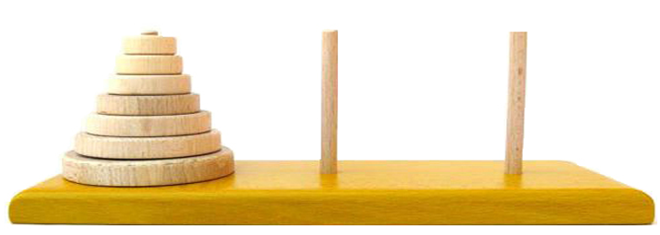

## HISTÓRIA E LENDA

A **Torre de Hanói**, também conhecida como **Torre do Bramanismo** ou **quebra-cabeça do fim do mundo**, foi inventada e vendida como brinquedo no ano de **1883**, pelo matemático francês **Édouard Lucas**. Segundo ele, o jogo — que era popular na **China** e no **Japão** — teria vindo do **Vietnã**.

O matemático foi inspirado por uma **lenda hindu**, que falava de um templo em **Benares**, cidade santa da **Índia**, onde existia uma torre sagrada do bramanismo cuja função era **melhorar a disciplina mental dos jovens monges**.

De acordo com a lenda, no grande templo de Benares, debaixo da cúpula que marca o centro do mundo, há uma **placa de bronze** sobre a qual estão fixadas **três hastes de diamante**. Em uma dessas hastes, o Deus **Brama**, no momento da criação do mundo, colocou **64 discos de ouro puro**, de forma que o disco maior ficasse sobre a placa de bronze e os outros fossem dispostos em ordem decrescente até o topo.

A atribuição dada aos monges era a de **transferir a torre formada pelos discos de uma haste para outra**, usando a terceira como auxiliar, respeitando as seguintes restrições:

* mover **apenas um disco por vez**;
* **nunca colocar um disco maior sobre um menor**.

Os monges deveriam trabalhar com eficiência, **noite e dia**, e quando terminassem o trabalho, o templo seria transformado em pó e o **mundo acabaria**.
O desaparecimento do mundo pode ser discutido, mas não há dúvida quanto ao **desmoronamento do templo**.

> Manoel, L. R. S. *Torres de Hanoi*. Disponível em:
> [http://www.ibilce.unesp.br/Home/Departamentos/Matematica/labmat/torre_de_hanoi.pdf](http://www.ibilce.unesp.br/Home/Departamentos/Matematica/labmat/torre_de_hanoi.pdf)

---

## JOGO

Tradicionalmente, o jogo possui:

* **3 hastes**:

  * Origem
  * Destino
  * Temporária

* Um **número qualquer de discos**, de tamanhos diferentes, dispostos na haste **Origem** em **ordem decrescente de tamanho**, com os maiores embaixo;

* **Objetivo**:
  Usando a haste **Temporária**, movimentar **um a um** os discos da haste **Origem** para a haste **Destino**, sempre respeitando a ordem de tamanho;

* **Regra fundamental**:

  > Um disco maior **nunca** pode ficar sobre um disco menor.

---

## QUESTÃO

Dada a implementação da **função recursiva** que resolve o problema das **Torres de Hanói**, execute **manualmente** o programa para **3 discos**.

Construa, para isso, conforme apresentado nos **slides 15 ao 26 da Nota de Aula 05 – Recursividade**, uma **tabela** que represente a **pilha de execução**, mostrando a **situação da memória** a cada chamada recursiva da função.

IMPLEMENTACÃO (main.cpp)

```cpp
#include <iostream>
#include <stdio.h>
#include <conio.h>
#include <locale.h>
// Inclusões de BiBliortecas
using namespace std;
// instrui o compilador a utilizar o namespace padrão (std) globalmente.

void mover(int n, char Orig, char Temp, char Dest);
// Assinatura da funão, qual demostra 4 paramentros, 1 deles do tipo inteiro e 3 do tipo char

int main()
{
    // Entrada no main
    setlocale(LC_ALL, "portuguese");
    // para configurar o programa C/C++ para reconhecer e exibir corretamente caracteres acentuados
    char ans;
    int n;
    // Declaração  de duas variaveis, uma de tipo char e outra de tipo inteiro
    do
    {
        cout << "Forneça o número de discos: ";
        cin >> n;
        // Relizou operalçoes com o ususario, uma de saida e 
        // outra que aguardou a entrada de valor, do tipo inteiro, para "n"
        mover(n, 'O', 'T', 'D');
        // Entrada na função mover(), com respsctivos 
        //paramentros, a espera padrão de tipo de parametro, 
        //confome a assinatura acima é que seja um inteiro 
        //como primeiro argumento, e 3 char nos tres seguintes


        cout << "Outra vez? (s/n): ";
        cin >> ans;

        // Foi feito mais uma interação com o usuario, 
        // perguntando se ele deseja continuar, e sua 
        // resposta é armazenada na variavel de tipo char, de nome "ans"
    }
    while (ans == 's' || ans == 'S');
    // Um loop, qual vai permitir quantidade N de repetições 
    // enquanto a resposta for diferente de "s" ou "S".
    cout << "Fim do programa.\n";
    getch();
    // Com o uso do getch() , o programa fica em pausa, 
    // mostrando as saidas anteriores, até que alguma tecla 
    // seja pressionada, sem precisar digitar enter especificamente.

}

void mover(int n, char Orig, char Temp, char Dest)
{
    // Entrada na fução mover()
    if (n == 1)
        // ultima operação caso n == 1, depois disso segue 
        // direto e esai da função
        printf("Mova o disco 1 da haste %c para a haste %c\n", Orig, Dest);
        // Ou seja , essa impressão e a ultima coisa feita 
        // dentro da função quando o condicional n==1 é alcançado
    else
    {
        mover(n - 1, Orig, Dest, Temp);
        // Só vem pra cá no momento
        printf("Mova o disco %d da haste %c para a haste %c\n", n, Orig, Dest);
        mover(n - 1, Temp, Orig, Dest);
    }
}
```

Com a primeira entrada em mover(), dentro do main, temos mover(n, 'O', 'T', 'D'), ou seja, teremos uma tabela :

M : main
A : sequancia depois da chamada da função que está no IF
B : saida para o print do else
C : Saida geral do else
|onde saio?| Profundidade : p | n |Orig | Temp | Dest | Ação / Print |
|-|-|-|-|-|-|-|
|||3| | | |Entrada geral|
|M|1|3|O|T|D|verificação do n ==1, segue pro else|
|M|1|3|O|T|D|dentro do else, chamou para p = 2, com n =2|
    |B|2|2|O|D|T|verificação do n ==1, segue pro else|
    |B|2|2|O|D|T|dentro do else, chamou para p = 3, com n =1|
        |B|3|1|O|T|D|verificação do n ==1, entra no if|
        |B|3|1|O|T|D|dentro if, imprime "Mova o disco 1 da haste O para a haste D"|
        |B|3|1|O|T|D|Primeira saida da Função, indo para p = 2, e frame da profundidade 3 é removido da pilha de execução|
    |B|2|2|O|D|T|vai para exatamnete para depois da primeira chamada da função no else, com p = 2|
    |B|2|2|O|D|T|dentro else, imprime "Mova o disco 2 da haste O para a haste T"|
    |B|2|2|O|D|T|dentro else, chama a função pela segunda vez, entrando em p = 3 e n = 1|
        |C|3|1|D|O|T|verificação do n ==1, entra no if|
        |C|3|1|D|O|T|dentro if, imprime "Mova o disco 1 da haste D para a haste T"|
        |C|3|1|D|O|T|saida da função do if p = 3, passando direto sob o else, indo para p = 2, e frame da profundidade 3 é removido da pilha de execução|
    |B|2|2|O|D|T|saida da função do if p = 2, indo direto para fim da função, indo para p = 1, e frame da profundidade 2 é removido da pilha de execução|
|M|1|3|O|T|D|dentro do else, chamou para p = 2, com n =2|


