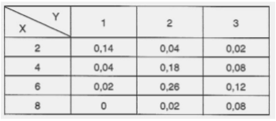
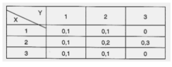

Seja X : renda familiar em R$1000,00 e Y : número de carros da família. Considere o quadro

|X|2|3|4|2|3|3|4|2|2|3|
|-|-|-|-|-|-|-|-|-|-|-|
|Y|1|2|2|2|1|3|3|1|2|2|

Calcular:
a) E(2X −3Y)

Z = (2X −3Y)
|     X|    2|    3|    4|    2|    3|    3|    4|    2|    2|    3|
|     -|    -|    -|    -|    -|    -|    -|    -|    -|    -|    -|
|     Y|    1|    2|    2|    2|    1|    3|    3|    1|    2|    2|
|Z     |    1|    0|    2|   -2|    3|   -3|   -1|    1|   -2|    0|
|P(Z)  | 1/10| 1/10| 1/10| 1/10| 1/10| 1/10| 1/10| 1/10| 1/10| 1/10|

a professora fez isso:

|   X\Y|    1|    2|    3| P(X)|
|     -|    -|    -|    -|    -|
|    2 | 2/10| 2/10|    0| 4/10|
|    3 | 1/10| 2/10| 1/10| 4/10|
|    4 |    0| 1/10| 1/10| 2/10|
|  P(Y)| 3/10| 5/10| 2/10|   1 |

|     Y|    1|    2|    3|
|     -|    -|    -|    -|
|  P(Y)| 3/10| 5/10| 2/10|
|Y*P(Y)| 3/10|10/10| 6/10|

E(Y) = 19/10

|     X|    2|    3|    4|
|     -|    -|    -|    -|
|  P(X)| 4/10| 4/10| 2/10|
|X*P(X)| 8/10|12/10| 8/10|

E(y) = 28/10

E(2X −3Y) = 2*28/10 - 3*19/10

b) COV(X,Y)

COV(X,Y)=E(XY)−E(X)E(Y)

|   p(X*Y)|    1   |      2|      3 |
|     -   |       -|      -|      - |
|    2    | 2* 2/10| 4*2/10| 6*   0 |
|    3    | 3* 1/10| 6*2/10| 9* 1/10|
|    4    | 4*    0| 8*1/10| 12*1/10|

soma tudo e obtem-se E(XY), e calcula cov(X,Y)

c) VAR(5X −3Y)

3- Num posto de vistoria de carros foram examinados 10 veículos, sendo que o número de irregularidades nos itens de segurança (X) e o número de irregularidades nos documentos Y são os dados no quadro a seguir. Calcule o coeficiente de correlaçãoo entre a variáveis X e Y .

|Veículos|1|2|3|4|5|6|7|8|9|10|
|-|-|-|-|-|-|-|-|-|-|-|
|X|0|1|2|0|1|2|0|2|1|2|
|Y|0|1|0|1|1|1|0|2|2|2|

resposta:

media de X = 1,1
media de Y = 1
|Veículos|1|2|3|4|5|6|7|8|9|10|
|-|-|-|-|-|-|-|-|-|-|-|
|X|0|1|2|0|1|2|0|2|1|2|
|Y|0|1|0|1|1|1|0|2|2|2|
X-Xmedio||||||||
Y-Ymedio||||||||
X-Xmedio*Y-Ymedio||||||||
(X-Xmedio)^2||||||||
(Y-Ymedio)^2||||||||

H= soma de todo X-Xmedio*Y-Ymedio
J= soma de todo (X-Xmedio)^2
F= soma de todo (Y-Ymedio)^2

correlação = H/sqrt(J*F)

4 - Sejam X : anos de experiência em vendas;
Y : unidades di´arias vendidas.

|   X\Y|    1|    2|    3| 
|     -| -| -| -|
|    2 | 0,14| 0,04| 0,02|
|    3 | 0,04| 0,18| 0,08|
|    4 | 0,02| 0,26| 0,12|
|    8 | 0| 0,02| 0,08|

Dada a tabela de distribui¸c˜ao conjunta de X e Y , cal-
cular COV (X, Y ).

$$
\text{Cov}(X,Y) = \sum_i \sum_j f_{ij} (X_i - \bar X)(Y_j - \bar Y)
$$

Suponha que X e Y tenham a seguinte tabela de
distribui¸c˜ao conjunta:

|   X\Y|    1|    2|    3| 
|     -| -| -| -|
|    1 | 0,1| 0,1| 0|
|    2 | 0,1| 0,2| 0,3|
|    3 | 0,1| 0,1| 0|

a) Determinar a fun¸c˜ao de probabilidade de X + Y e,
a partir da´ı, E(X + Y ).

b) Determinar a fun¸c˜ao de probabilidade de (X.Y ) e,
em seguida, calcular E(X.Y ).
c) Mostrar que E(X.Y ) = E(X).E(Y ) ocorra, X e Y
n˜ao s˜ao independentes.